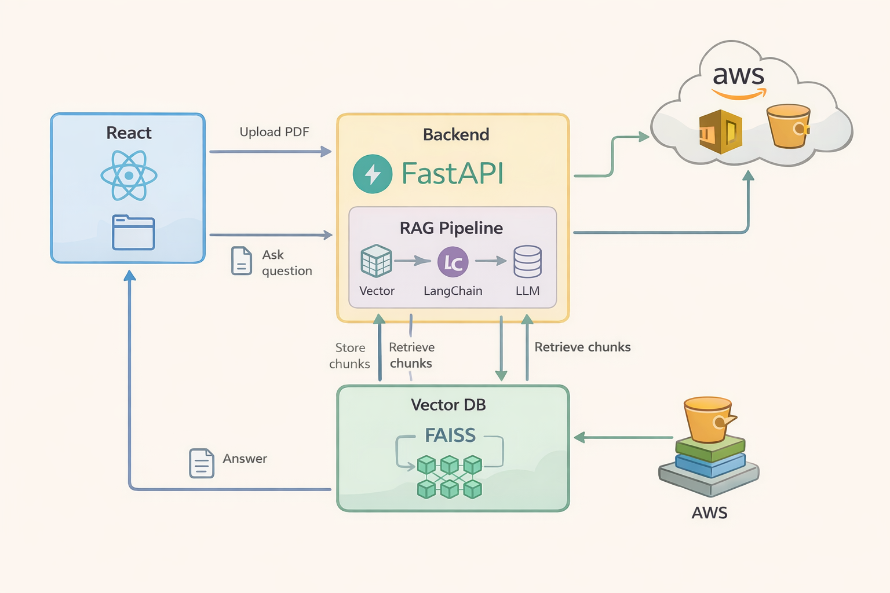
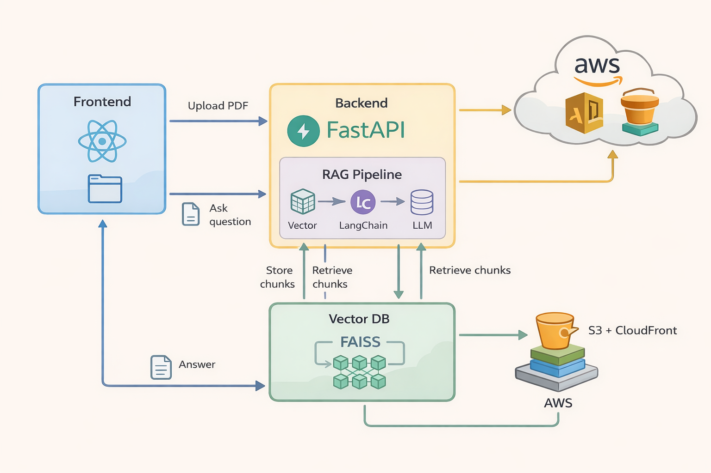

# RAG Powered Smart PDF Assistant

> Upload any PDF. Ask questions in plain English. Get grounded answers with confidence scores and source page references — powered by OpenAI, LangChain, FAISS, and FastAPI.

---

## What is this?

Most AI chatbots answer from memory. That means they can hallucinate, go out of date, or simply make things up.

This project takes a different approach: **Retrieval-Augmented Generation (RAG)**. Instead of relying on the model's trained knowledge, every answer is grounded in the actual content of a document you upload. The system retrieves the most relevant chunk from your PDF, feeds it as context to the LLM, and returns a structured response — with a confidence score and the source page.

Think of it as **a search engine and a chat assistant fused together**, but for your own documents.

---

## What it can do

- **Upload any PDF** — resumes, reports, research papers, contracts
- **Ask natural language questions** — no SQL, no keyword search
- **Get grounded answers** — the LLM only answers from retrieved context; if the answer isn't in the document it returns `NOT FOUND` instead of hallucinating
- **See where the answer came from** — confidence score and source page number for every response
- **Structured error responses** — every failure (missing API key, no index, provider down) returns a typed JSON error body, not a stack trace
- **Live backend status detection** — the frontend checks backend health on load and surfaces warnings before you even make a request

---

## How it works



*The upload path: React sends the PDF to FastAPI, which parses it, splits it into chunks, embeds each chunk with OpenAI, and stores the vectors in a local FAISS index.*



*The ask path: the question is embedded, top-k similar chunks are retrieved from FAISS, injected as context into the prompt, and GPT-4o-mini returns a grounded JSON response.*

### Flow summary

| Step | What happens |
|------|-------------|
| 1 | User uploads PDF via React UI |
| 2 | FastAPI receives the file, passes it to `PyPDFLoader` |
| 3 | LangChain splits the text into overlapping chunks (500 tokens, 50 overlap) |
| 4 | OpenAI embeddings convert each chunk into a vector |
| 5 | FAISS stores the vectors locally in `faiss_index/` |
| 6 | User asks a question |
| 7 | The question is embedded; top-3 similar chunks are retrieved |
| 8 | Chunks + question are injected into a structured RAG prompt |
| 9 | GPT-4o-mini returns: `answer`, `confidence`, `source_page` |
| 10 | React displays the result with source attribution |

---

## Tech stack

| Layer | Technology |
|-------|-----------|
| Frontend | React 18, TypeScript, Vite |
| Backend API | FastAPI 0.135, Uvicorn |
| LLM | OpenAI GPT-4o-mini |
| Embeddings | OpenAI `text-embedding-ada-002` |
| Orchestration | LangChain, LangChain-OpenAI |
| Vector store | FAISS (local, CPU) |
| PDF parsing | PyPDF + LangChain PyPDFLoader |
| Validation | Pydantic v2, pydantic-settings |
| Error model | Typed exception hierarchy → structured JSON |

---

## Project structure

```
gen-ai-proj/
├── app/
│   ├── main.py               # FastAPI app, all endpoints
│   ├── config.py             # Settings via pydantic-settings
│   ├── schemas.py            # Request/response models
│   ├── llm_client.py         # Direct /ask endpoint (no RAG)
│   ├── errors.py             # Typed exception hierarchy
│   ├── error_handlers.py     # Centralized handler registration
│   └── rag/
│       ├── pipeline.py       # ingest_pdf(), ask_with_context()
│       ├── index_store.py    # FAISS build, load, search
│       ├── prompts.py        # RAG system + user prompt templates
│       └── metadata.py       # Page number extraction helpers
├── frontend/
│   ├── src/
│   │   ├── App.tsx           # Main React component
│   │   ├── api.ts            # uploadPdf(), askRag(), fetchStatus()
│   │   ├── types.ts          # TypeScript interfaces for API contracts
│   │   └── styles.css        # All UI styles
│   └── public/
│       └── architecture.png  # System diagram served by Vite
├── docs/
│   ├── architecture-upload.png
│   └── architecture-full.png
├── faiss_index/              # Auto-created after first upload
├── requirements.txt
└── .env                      # OPENAI_API_KEY (not committed)
```

---

## Getting started

### Prerequisites

- Python 3.10+
- Node.js 18+
- An OpenAI API key

---

### 1. Clone and set up the backend

```bash
git clone https://github.com/your-username/gen-ai-proj.git
cd gen-ai-proj
```

Create a `.env` file in the project root:

```env
OPENAI_API_KEY=sk-...
OPENAI_MODEL=gpt-4o-mini
```

Create and activate a virtual environment:

```bash
# Windows
py -m venv .venv
.\.venv\Scripts\Activate.ps1

# macOS / Linux
python3 -m venv .venv
source .venv/bin/activate
```

Install dependencies:

```bash
pip install -r requirements.txt
```

Start the backend:

```bash
python -m uvicorn app.main:app --reload --host 127.0.0.1 --port 8000
```

Verify it is running:

```bash
curl http://127.0.0.1:8000/health
# {"status":"ok"}
```

---

### 2. Set up and run the frontend

```bash
cd frontend
npm install
npm run dev
```

Open `http://127.0.0.1:5173` (or whichever port Vite assigns) in your browser.

---

### 3. Try it

1. Upload a PDF using the **Upload PDF** panel
2. Wait for the indexed chunks count to appear
3. Type a question in the **Ask Question** panel
4. The result panel shows: **answer**, **confidence**, **source page**

If the answer is not in the document, you will get `NOT FOUND` — not a hallucination.

---

## API reference

| Method | Path | Description |
|--------|------|-------------|
| `GET` | `/health` | Simple liveness check |
| `GET` | `/status` | Provider key status + index availability |
| `POST` | `/upload` | Upload and index a PDF |
| `POST` | `/rag/ask` | Ask a question against the indexed document |
| `POST` | `/rag/debug` | Inspect top-k retrieved chunks for a query |
| `POST` | `/ask` | Direct LLM call without RAG (no document) |

**POST /upload** — multipart/form-data with `file` field
Returns: `{ filename, chunks_indexed }`

**POST /rag/ask** — `{ "question": "..." }`
Returns: `{ answer, confidence, source_page, source_snippet }`

**POST /rag/debug** — `{ "question": "..." }`
Returns list of retrieved chunks with scores and page numbers

**Error shape** — all errors return:
```json
{
  "error": {
    "code": "provider_auth_error",
    "title": "OpenAI authentication failed",
    "detail": "The API key is invalid or expired.",
    "hint": "Check your OPENAI_API_KEY in the .env file."
  }
}
```

---

## Limitations

- **Single document** — only one PDF can be indexed at a time. Uploading a new file replaces the previous index.
- **Local vector store** — FAISS index is stored on disk next to the server process. It does not survive container restarts unless the volume is mounted.
- **No authentication** — the API has no auth layer. Do not expose port 8000 to the public internet without adding API key or OAuth protection.
- **Chunk size is fixed** — 500 tokens with 50 overlap works well for most text-heavy PDFs. Documents with complex tables, scanned images, or code blocks may produce lower-quality chunks.
- **Page numbers are best-effort** — PyPDF extracts page metadata where available; some PDFs do not embed it reliably.
- **No conversation history** — each RAG call is stateless. There is no memory of previous questions in a session.

---

## Open for enhancements

This project is intentionally kept lean so every component is visible and understandable. Good next steps if you want to extend it:

- **Multi-document support** — namespace FAISS indexes by user session or document ID
- **Streaming responses** — stream the LLM tokens back to the frontend using Server-Sent Events
- **Pinecone / Weaviate** — swap FAISS for a managed vector database for production scalability
- **Authentication** — add JWT or API key middleware to the FastAPI layer
- **AWS deployment** — S3 for document storage, EC2 or ECS for the backend, CloudFront + S3 for the frontend, Secrets Manager for the OpenAI key
- **Evaluation** — add a ragas-style evaluation harness to score answer quality against a ground-truth set
- **Chat history** — add a conversation memory buffer so follow-up questions are resolved in context
- **File type support** — extend beyond PDF to `.docx`, `.txt`, and `.md` using LangChain document loaders

---

## License

MIT — free to use, fork, and build on.

---

*Built as a learning project to demonstrate production-ready RAG patterns with FastAPI, LangChain, and React.*

